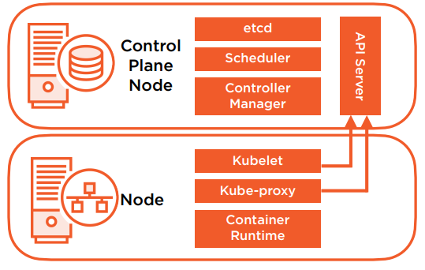

# Installing and Configuring Kubernetes

## Installation Considerations

Where to install?

- Cloud
  - IaaS - Virtual Machines
  - PaaS - Managed Service
- On-Premises
  - Bare Metal
  - Virtual Machines

Which one should you choose?

Cluster Networking

Scalability

High Availability

Disaster Recovery

## Installation Overview

### Installation Methods

- Desktop
- kubeadm
- Cloud Scenarios

### Installation Requirements

System Requirements

- Linux - Ubuntu/RHEL
- 2 CPUs
- 2GB RAM
- Swap Disabled

Container Runtime

- Container Runtime Interface (CRI)
- containerd
- Docker (Deprecated 1.20)
- CRI-O

Networking

- Connectivity between all Nodes
- Unique hostname
- Unique MAC Address

Cluster Network Ports



- Control Plane Node Ports

  | Component          | Ports (tcp) | Used By       |
  | ------------------ | ----------- | ------------- | ---- |
  | API                | 6443        | All           |
  | etcd               | 2379-2380   | API/etcd      |
  | Scheduler          | 10251       | Self          |
  | Controller Manager | 10252       | Self          |
  | Kubelet            | 10250       | Control Plane | Self |

- Node Ports

  | Component | Ports (tcp) | Used By       |
  | --------- | ----------- | ------------- |
  | Kubelet   | 10250       | Control Plane |
  | NodePort  | 30000-32767 | All           |

## Getting Kubernetes

- https://github.com/kubernetes/kubernetes
- Linux distribution

## Installing a Cluster with kubeadm

- Install and Configure Packages
- Create Your Cluster
- Configure Pod Networking
- Join Nodes to Your Cluster

Required Packages

- containerd
- kubelet
- kubeadm
- kubectl

> Note: Install on all Nodes in your cluster

### Installing Kubernetes on Ubuntu VMs

```bash
sudo apt-get install -y containerd

curl -s https://packages.cloud.google.com/apt/doc/apt-key.gpg | sudo apt-key add -

cat <<EOF >/etc/apt/sources.list.d/kubernetes.lis
deb https://apt.kubernetes.io/ kubernetes-xenial main
EOF

apt-get update
apt-get install -y kubelet kubeadm kubectl
apt-mark hold kubelet kubeadm kubectl containerd
```

### Lab Environment
