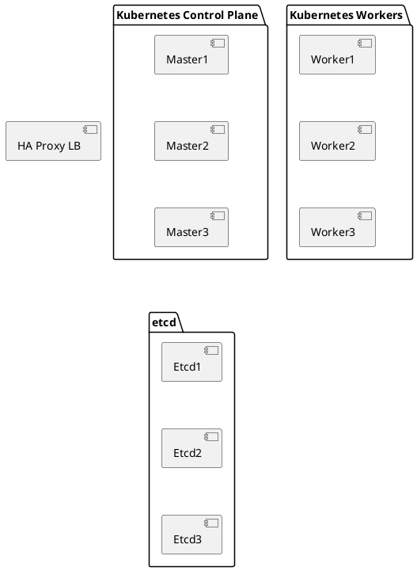

# Introduction

## Tools

- Virtual Box
- Vagrant
- Ubuntu 20.04

## System Requirements

- 7 VMS (etcd, LB, worker nodes): 1 GB RAM, 5GB storage
- 3 VMS (master nodes): 2 GB RAM, 5 GB storage, 2 CPUs

10VMs (total of ~50 GB storage, 13 GB RAM, 2 CPUs/cores)

## Setup Process



### Step 1 - Create etcd cluster

Run `install-etcd.sh` on each node for etcd and give the ip of the corresponding etcd node as argument.

```bash
./install-etcd.sh {etcd#no-ip}
```
